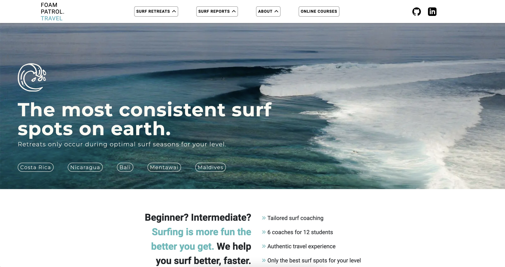

# Hello there! 👋

I'm a **frontend developer** based in the **SF Bay Area**.  
Check out my portfolio at: <a href="https://aaronkodes.netlify.app/" target="_blank" >AaronKodes</a>  
You can send me a message on <a href="https://www.linkedin.com/in/aaronkwok1/" target="_blank" >LinkedIn</a> 📫

## 💻 Skills  

- React, Redux, JavaScript, HTML, CSS

## 🌱 Growth

- Lately, I've been learning NodeJS and Express!

## 💼 Projects

<table>
    <tr>
        <td></td>
        <td>
            
<strong>FOAM PATROL</strong>

            
<a href="https://foampatrol.netlify.app/">Live Site</a> 
            <a href="https://github.com/AaronoKwok/foam-patrol2">View Code</a>

            
Foam Patrol is a site I created to connect people who enjoy the sport of surfing or want to get into it. It hosts surf forecasts, surf trips, and paths to surf tutorials. 🤙

            This project helped me gain a better understanding of:
            <ul>
                <li>React</li>
                <li>API data retrieval</li>
                <li>Javascript's built-in Date object</li>
                <li>Mobile responsiveness</li>
            </ul>
        </td>
    </tr>
</table>

<!--
**AaronoKwok/AaronoKwok** is a ✨ _special_ ✨ repository because its `README.md` (this file) appears on your GitHub profile.

Here are some ideas to get you started:

- 💻 
- 💼
- 🔭 I’m currently working on ...
- 🌱 I’m currently learning ...
- 👯 I’m looking to collaborate on ...
- 🤔 I’m looking for help with ...
- 💬 Ask me about ...
- 📫 How to reach me: ...
- 😄 Pronouns: ...
- ⚡ Fun fact: ...
-->
